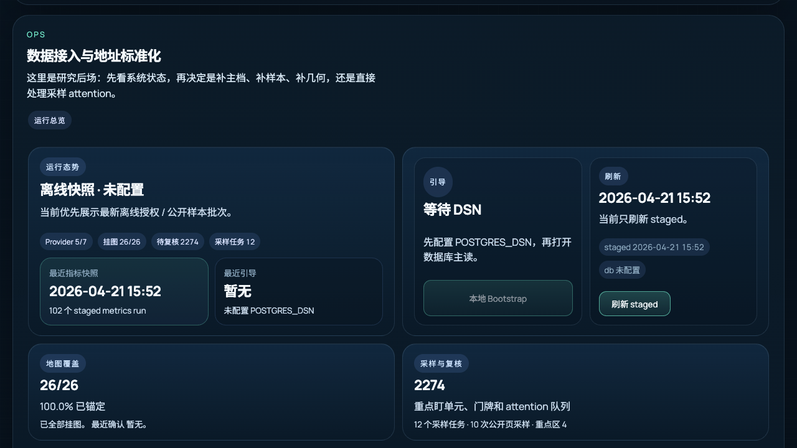

# Yieldwise · 租知

[](https://github.com/Leonard-Don/yieldwise/actions/workflows/validate.yml)
[](LICENSE)

**Open-source workbench for analyzing rental-yield data — visualize properties on a map, compute yield / payback / occupancy KPIs.**

[中文 README](README.zh.md)

<p align="center">
  
</p>

## Contents

- [What is this](#what-is-this)
- [Who is this for](#who-is-this-for)
- [Why it exists](#why-it-exists)
- [Quick start](#quick-start)
- [Features](#features)
- [Architecture](#architecture)
- [Data sources](#data-sources)
- [Limitations](#limitations)
- [Development and testing](#development-and-testing)
- [Documentation](#documentation)
- [Project status](#project-status)
- [Contributing](#contributing)
- [License](#license)
- [Contact](#contact)

## What is this

Yieldwise is a personal-scale real-estate analysis tool. It:

- Plots properties on a map alongside open-data communities and OSM building footprints
- Computes rental yield / payback / occupancy KPIs per district / community / building
- Lets you compare candidates against the local market in seconds

**Run it locally on your machine. Your data never leaves it.**

## Who is this for

- **Individual investors** who want to look at rental yield distributions across districts before bidding on a property
- **FinTech / urban-economics / real-estate finance students and researchers** who need a quick analytical scaffolding for coursework or research
- **Tinkerers** who want to see what a "Bloomberg terminal for Chinese rentals" might look like as an open-source side project

## Why it exists

Public real-estate data in China is scattered across government open-data portals, OSM, AMAP POIs, and PDF reports priced for institutions. Yieldwise stitches the open-source bits into one place.

No login-gated or unauthorized scraping — only public open data and browser-captured public pages.

## Quick start

Prerequisites: Python 3.13+ and a local Postgres + PostGIS instance. [Postgres.app](https://postgresapp.com/) is the lightest option on macOS and bundles PostGIS.

```bash
git clone https://github.com/Leonard-Don/yieldwise.git
cd yieldwise
cp .env.example .env             # edit .env to set AMAP_API_KEY (free, see below)

python3 -m venv .venv && source .venv/bin/activate
pip install -r api/requirements.txt

createdb yieldwise                                                # one-time
psql yieldwise -c "CREATE EXTENSION IF NOT EXISTS postgis"        # one-time

export $(grep -v '^#' .env | xargs)
uvicorn api.main:app --reload --port 8000
```

Open `http://localhost:8000` to see the map.

The schema is applied automatically on first DB use, so no manual `psql -f` is needed.

Need a free AMAP key for the map to render? Get one at [lbs.amap.com](https://lbs.amap.com/api/javascript-api-v2/prerequisites).

### Local demo without Postgres

Want to inspect the UI first? You can boot the demo/mock mode without creating a database:

```bash
python3 -m venv .venv && source .venv/bin/activate
pip install -r api/requirements.txt
ATLAS_ENABLE_DEMO_MOCK=1 uvicorn api.main:app --reload --port 8000
```

This is only for local exploration. Real analysis should use Postgres/PostGIS plus open-data imports or public-page browser-scrape batches.

## Features

- **One research desk** — citywide map, key buildings, floor-level evidence, and public-page sampling on a single workbench: judge where to look first, then decide what to capture next.
- **Candidate research loop** for communities / buildings / districts, grouped by due review, target triggers, price/sample changes, evidence gaps, and shortlist state
- **Candidate comparison + local memo export**, including investment thesis, buy reasons, objections, evidence sources, pending checks, and next actions
- **OSM + AMAP merged building footprints** with quota-based community matching
- **Ops refresh center** for dry-running and executing staged reference/import/geo/metrics refresh jobs, with job history, anomaly triage, and geometry QA

<p align="center">
  
</p>

## Architecture

- **Backend** — FastAPI (Python 3.13); all HTTP routes live in `api/main.py`.
- **Database** — PostgreSQL + PostGIS; schema in `db/schema.sql`, applied automatically on first use.
- **Frontend** — vanilla JavaScript, no framework. A backstage research workbench in `frontend/backstage/` and a lighter end-user view in `frontend/user/`.
- **Data pipeline** — standalone import/refresh scripts in `jobs/` produce timestamped, reversible staged runs; nothing is overwritten in place.

Coordinates are stored in both GCJ-02 and WGS-84 so AMAP communities and OSM footprints stay datum-consistent.

## Data sources

| Layer | Source | License |
|---|---|---|
| Building footprints | OpenStreetMap | ODbL |
| Community boundaries | AMAP POI | Per AMAP ToS |
| District boundaries | Shanghai government open data | Open Government Data |
| Listings (sample) | Synthetic / browser-scraped demo set | Self-generated |

Yieldwise keeps the listing path to public-page browser scraping only: no manual data-entry UI and no auto-fetching of anything that requires authorization.

## Limitations

- **Shanghai only** — no multi-city abstraction; city constants are inlined in `api/config/city.py`.
- **Sample data is not a live feed** — bundled listings are synthetic / browser-sampled snapshots; real analysis depends on running open-data imports or public-page sampling batches yourself.
- **Snapshot-based, not real-time** — metrics reflect the last refresh, not the live market.
- **Needs a free AMAP key** for the map to render.
- **No authentication** — built to run locally as a single-user tool; don't expose it to a network as-is.

## Development and testing

```bash
pip install -r api/requirements-dev.txt   # test + lint dependencies
pytest                                    # backend tests
node --test tests/frontend/*.mjs           # frontend unit tests
ruff check .                               # lint
```

On every push and pull request, CI ([`validate.yml`](.github/workflows/validate.yml)) also runs a Python compile check, JavaScript syntax checks, and a route smoke test. See [CONTRIBUTING.md](CONTRIBUTING.md) for the staged-data workflow and common refresh commands.

## Documentation

- [Changelog](docs/CHANGELOG.md)
- [API contract](docs/api-contract.md)
- [Importing geo assets](docs/import-geo-assets.md)
- [Importing the reference dictionary](docs/import-reference-dictionary.md)
- [Browser-capture import](docs/internal/import-public-browser-capture.md)
- [Dependency licenses](docs/legal/dependency-licenses.md)

## Project status

**v1.0 — maintenance mode.** Yieldwise is a personal local real-estate research workbench, not a commercial product. The core self-use loop is complete; ongoing work is limited to bug fixes and data-quality / correctness improvements rather than a roadmap of new features.

The self-use loop it supports:

- Discover opportunities on the map → inspect community / building / floor evidence → add to the candidate desk
- Set target price, target rent, target yield, and review due dates
- Track target triggers, price/yield changes, due reviews, evidence gaps, and same-floor sample changes through alerts
- Run candidate actions: complete review, defer review, shortlist, or reject
- Export local Markdown decision memos
- Maintain data quality, public sampling, review queues, and geometry QA from the backstage refresh center

Backend, frontend, and full-browser regression tests are the validation baseline.

## Contributing

Yieldwise is in maintenance mode with no new-feature roadmap, but blocking bugs and data-quality issues are welcome. See [CONTRIBUTING.md](CONTRIBUTING.md).

## License

MIT — see [LICENSE](LICENSE). The MIT grant covers Yieldwise's source code only; data sources retain their own licenses (OSM ODbL, AMAP ToS, etc.).

## Contact

For questions, feedback, or bug reports, please use [GitHub Issues](https://github.com/Leonard-Don/yieldwise/issues) or [Discussions](https://github.com/Leonard-Don/yieldwise/discussions).

If you find this useful, a star on the repo helps a lot.
