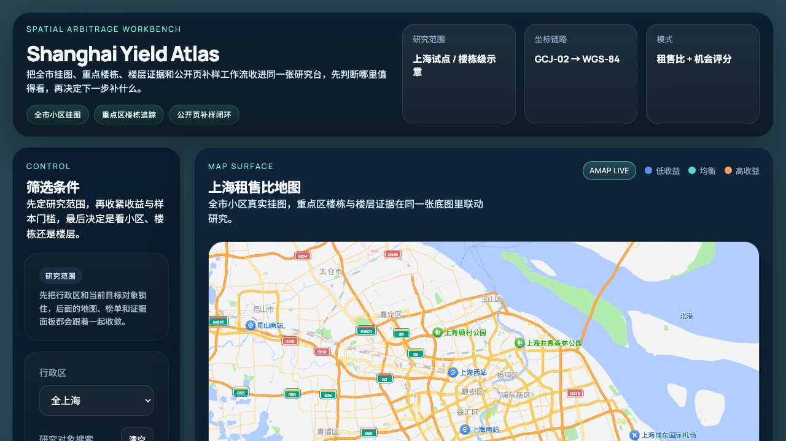

# Yieldwise · 租知

[](https://github.com/Leonard-Don/yieldwise/actions/workflows/validate.yml)
[](LICENSE)

**开源租赁资产分析工作台 —— 把房源画在一张地图上，自动算租售比 / 回本年限 / 出租率。**

[English README](README.md)

<p align="center">
  
</p>

## 目录

- [这是什么](#这是什么)
- [谁会用得上](#谁会用得上)
- [为什么做这个](#为什么做这个)
- [快速开始](#快速开始)
- [功能](#功能)
- [架构](#架构)
- [数据来源](#数据来源)
- [已知限制](#已知限制)
- [开发与测试](#开发与测试)
- [文档](#文档)
- [项目状态](#项目状态)
- [贡献](#贡献)
- [许可](#许可)
- [联系](#联系)

## 这是什么

Yieldwise 是一个**个人级**的房地产分析工具。它会：

- 把房源和开放数据小区 + OSM 楼栋画在一张地图上
- 按行政区 / 小区 / 楼栋粒度算租售比 / 回本年限 / 出租率 KPI
- 几秒内对比标的与本地市场

**本地跑，数据不出你的电脑。**

## 谁会用得上

- **个人投资者**：在出价之前想看一眼某个区的租售比分布
- **金融科技 / 城市经济学 / 房地产金融的学生 / 研究者**：写论文 / 做课题需要快速分析底稿
- **爱折腾的人**：想看看一个"中国租赁市场版的彭博终端"长啥样，作为开源副项目玩玩

## 为什么做这个

中国公开房产数据散在政府开放数据门户、OSM、高德 POI、给机构看的 PDF 报告里。Yieldwise 把开源那部分拼起来。

**不碰登录态、不碰授权数据、不做高频抓取** —— 只用公开开放数据与公开页面浏览器抓取批次。

## 快速开始

环境要求：Python 3.13+，本地有 Postgres + PostGIS。macOS 上 [Postgres.app](https://postgresapp.com/) 最轻，自带 PostGIS。

```bash
git clone https://github.com/Leonard-Don/yieldwise.git
cd yieldwise
cp .env.example .env             # 编辑 .env 填入 AMAP_API_KEY（免费，见下方）

python3 -m venv .venv && source .venv/bin/activate
pip install -r api/requirements.txt

createdb yieldwise                                                # 一次性
psql yieldwise -c "CREATE EXTENSION IF NOT EXISTS postgis"        # 一次性

export $(grep -v '^#' .env | xargs)
uvicorn api.main:app --reload --port 8000
```

打开 `http://localhost:8000` 看地图。

Schema 首次访问时自动建好，不需要手动 `psql -f`。

需要免费高德 key 才能渲染地图？去 [lbs.amap.com](https://lbs.amap.com/api/javascript-api-v2/prerequisites) 申请。

### 不接 Postgres 的本地 demo

如果只是想先看 UI，可以不建数据库，直接用 demo/mock 模式：

```bash
python3 -m venv .venv && source .venv/bin/activate
pip install -r api/requirements.txt
ATLAS_ENABLE_DEMO_MOCK=1 uvicorn api.main:app --reload --port 8000
```

这只适合本地试用。真实分析仍然建议接 Postgres/PostGIS，并使用公开开放数据或浏览器公开页抓取批次。

## 功能

- **一张「收益研究台」** —— 全市挂图、重点楼栋、楼层证据、公开页补样收在同一张研究台：先判断哪里值得看，再决定下一步补什么。
- **候选研究闭环**：把小区 / 楼栋 / 区域加入候选，按到期复核、目标触发、价格 / 样本变化、证据缺口和 shortlist 分组处理
- **候选对比与本地备忘录**：导出含投资假设、买入理由、反对理由、证据来源、待核验项和下一步动作的 Markdown 研究备忘录
- **OSM + 高德楼栋融合** 含 per-community 配额匹配
- **Ops 刷新中心**：在后台 dry-run 并执行 staged reference/import/geo/metrics 刷新 job，保留执行历史、异常处理队列和几何 QA

## 架构

- **后端** —— FastAPI（Python 3.13）；全部 HTTP 路由在 `api/main.py`。
- **数据库** —— PostgreSQL + PostGIS；schema 在 `db/schema.sql`，首次使用时自动建好。
- **前端** —— 原生 JavaScript，无框架。后台研究工作台在 `frontend/backstage/`，更轻量的终端用户视图在 `frontend/user/`。
- **数据管线** —— `jobs/` 里的独立导入 / 刷新脚本产出带时间戳、可回滚的 staged 批次，不就地覆盖。

坐标同时保存 GCJ-02 和 WGS-84 两套，保证高德小区与 OSM 楼栋在同一基准下对齐。

## 数据来源

| 层 | 来源 | 许可 |
|---|---|---|
| 楼栋形状 | OpenStreetMap | ODbL |
| 小区边界 | 高德 POI | 按高德 ToS |
| 行政区边界 | 上海政府开放数据 | 开放政府数据 |
| 挂牌（demo）| 合成 / 浏览器抓取样例 | 自生成 |

Yieldwise 只保留公开页面浏览器抓取口径，不提供人工录入数据入口，不主动获取任何需要授权的数据。

## 已知限制

- **仅支持上海** —— 不抽象多城市，城市常量内联在 `api/config/city.py`。
- **样例数据不是实时源** —— 自带房源是合成 / 浏览器抽样的快照；真实分析依赖你自己跑开放数据导入或公开页采样批次。
- **基于快照，非实时** —— 指标反映的是上一次刷新，不是当前市场。
- **地图需要免费高德 key** 才能渲染。
- **无鉴权** —— 按本地单用户工具设计，不要原样暴露到网络上。

## 开发与测试

```bash
pip install -r api/requirements-dev.txt   # 测试 + lint 依赖
pytest                                    # 后端测试
node --test tests/frontend/*.mjs           # 前端单元测试
ruff check .                               # lint
```

每次 push 和 PR，CI（[`validate.yml`](.github/workflows/validate.yml)）还会跑 Python 编译检查、JS 语法检查和路由 smoke 测试。staged 数据工作流和常用刷新命令见 [CONTRIBUTING.md](CONTRIBUTING.md)。

## 文档

- [更新日志](docs/CHANGELOG.md)
- [API 契约](docs/api-contract.md)
- [导入地理资产](docs/import-geo-assets.md)
- [导入参考词典](docs/import-reference-dictionary.md)
- [浏览器抓取导入](docs/internal/import-public-browser-capture.md)
- [依赖许可](docs/legal/dependency-licenses.md)

## 项目状态

**v1.0 —— 维护模式。** Yieldwise 是个人本地房产投研工作台，不是商业产品。核心自用闭环已经完成；后续工作只限于修 bug 和数据质量 / 正确性改进，不规划新功能路线图。

它支撑的自用闭环：

- 地图发现机会 → 查看小区 / 楼栋 / 楼层证据 → 加入候选研究台
- 设置目标价、目标租金、目标收益率和复核日
- 用 alerts 跟踪目标触发、价格 / 收益变化、到期复核、证据缺口和同楼层新样本
- 执行复核完成、延后、shortlist、放弃等候选动作
- 导出本地 Markdown 决策备忘录
- 在后台刷新中心完成数据质量、公开采样、review queue 和几何 QA 的本地维护

后端、前端和浏览器回归测试是验收基线。

## 贡献

项目处于维护模式，没有新功能路线图；阻塞性 bug 和数据质量问题仍欢迎提出。见 [CONTRIBUTING.md](CONTRIBUTING.md)。

## 许可

MIT —— 见 [LICENSE](LICENSE)。MIT 仅覆盖 Yieldwise 自己的源码；数据来源各有各的许可（OSM ODbL、高德 ToS 等）。

## 联系

有问题 / 反馈 / bug，请走 [GitHub Issues](https://github.com/Leonard-Don/yieldwise/issues) 或 [Discussions](https://github.com/Leonard-Don/yieldwise/discussions)。

觉得有用的话，给个 star 我会很开心。
